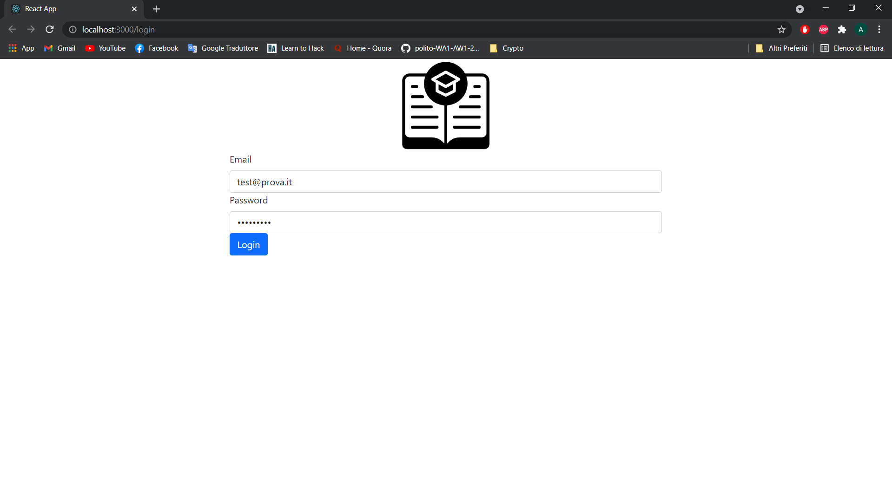
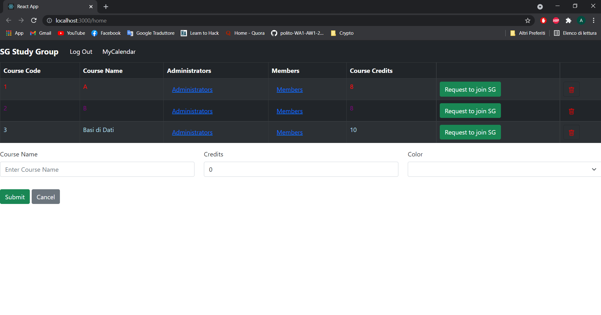
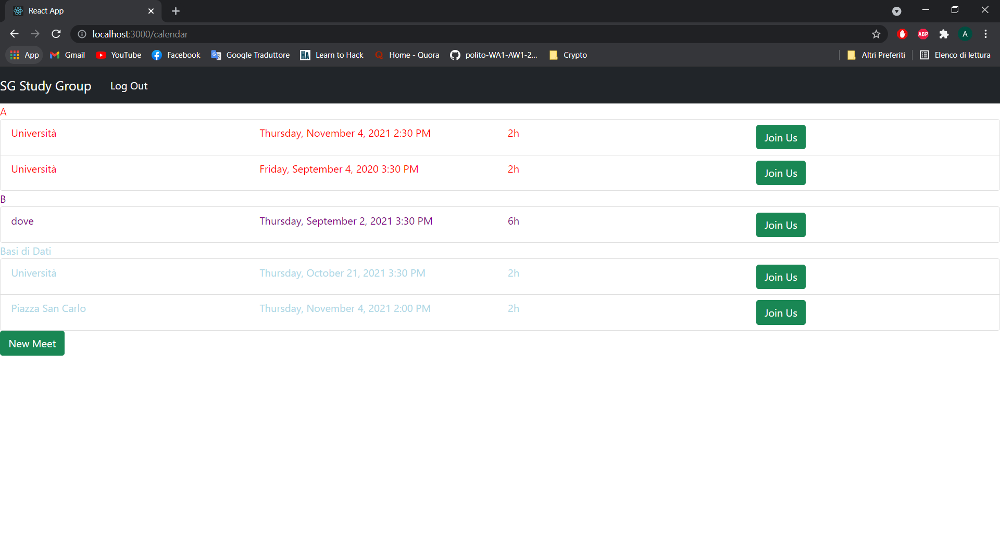

# Exam #3: "Gruppi Studio"
## Student: s280119 Chimirri Armando 

## React Client Application Routes

- Route `/`: redirect to Route `/Login` or if the user is already logged in it redirect to route `/home`
- Route `/home`: this is the main page of react application. It shows the list of course you can join or already you have already joined. This page changes if you are general administrator you can see two links "administrators" and "members" that show the list of administrators and members that show the list of members and here you can accept or reject request and promote o demote other stundents to group administrator.
As General Administrator you can see a button that allow you to create other Courses and another one that let you delete them.
As a student you can see the same course list, but you can't see the administrators list and you can see the members list only if you are the Group Administrator of that course.
The navbar is the same for each role, it is composed by 3 buttons the first one reload the home `home`, the second one is the log out button and the third one is "My calendar" button that redirect you to `/calendar`
- Route `/calendar`: this is the page that let you see the meeting for each course. You can join a meeting or cancel the partecipation. If you are a General Administrator o a Group Administrator you can see a button that let you make a new meeting. As general administrator you can also filter this list demoting or promoting yourself in the `/home`.

## API Server

**Login User**

- Description: authenticates the user who is trying to do the login if username and password are correct.

* POST `/api/sessions`

- Request body: username and password of the user.

```json
POST /api/sessions HTTP/1.1
Content-Type: application/json

{
    "username": "test@prova.it",
    "password":"test",
}

```

- Response: `200 OK` (success)

* Response body content:

```json
{
  "id": 1,
  "username": "test@prova.it",
  "amministratore":"1"
}
```

- Error responses: `500 Internal Server Error` (generic error), `401 Unauthorized User` (user is not logged in)

**Logout User**

- Description: logs out the current user.

* DELETE `/api/sessions/current`

- Request parameters: _None_

```json
DELETE /api/sessions/current HTTP/1.1
```

- Response: `200 OK` (success)

* Error responses: `500 Internal Server Error` (generic error), `401 Unauthorized User` (login failed)

**Get Current User**

- Description: check if the current user is logged and retrieves his data (id, username (email) and amministratore).

* GET `/api/sessions/current`

- Request parameters: _None_

```json
GET /api/sessions/current HTTP/1.1
```

- Response: `200 OK` (success)

* Response body content:

```json
{
  "id": 1,
  "username": "test@prova.it",
  "amministratore":"1",
}
```

- Error responses: `500 Internal Server Error` (generic error), `401 Unauthorized User` (user is not logged in)

**GET study group list**

- GET `/api/studygrouplist`

- Description: get all courses from the table subjects.

```json

  GET /api/studygrouplist  HTTP/1.1

```
- Response: `200 OK` (success)

- Response body content

```json
[{"idcorso":1,"nomecorso":"Applicazioni Web","crediti":8,"colore":"red"},...]
```
Error responses: `500 Internal Server Error` (generic error), `401 Unauthorized User` (user not authenticated)

**GET ALL study group list**

- GET `/api/studygrouplist`

- Description: get all gs from the table gs.

```json

  GET /api/allstudygrouplist  HTTP/1.1

```
- Response: `200 OK` (success)

- Response body content

```json
[{"idcorso":2,"nomecorso":"Information System Security","crediti":8,"idstudente":2,"ruolo":1,"colore":"purple","richiesta":0},...]
```
Error responses: `500 Internal Server Error` (generic error), `401 Unauthorized User` (user not authenticated)

**GET My study group list**

- GET `/api/mystudygrouplist`

- Description: get the authenticated user gs from the table gs. (I know this is not efficent and not really usefull)

- Request parameters: user id

```json

  GET /api/mystudygrouplist  HTTP/1.1

```
- Response: `200 OK` (success)

- Response body content

```json
[{"idcorso":2,"nomecorso":"Information System Security","crediti":8,"idstudente":2,"ruolo":1,"colore":"purple","richiesta":0},...]
```
Error responses: `500 Internal Server Error` (generic error), `401 Unauthorized User` (user not authenticated)

**GET partecipation**

- GET `/api/partecipation`

- Description: get all the rows of partecipanti table 

```json

  GET /api/partecipation  HTTP/1.1

```
- Response: `200 OK` (success)

- Response body content

```json
[{"idstudente":1,"idcorso":1,"idincontro":1},...]
```
Error responses: `500 Internal Server Error` (generic error), `401 Unauthorized User` (user not authenticated)

**GET all meetings**

- GET `/api/allmeet`

- Description: get all the rows of incontri table 

```json

  GET /api/allmeet  HTTP/1.1

```
- Response: `200 OK` (success)

- Response body content

```json
[{"idcorso":1,"data":"2021-11-04T13:30:00.000Z","idincontro":1,"durata":2,"luogo":"Università"},...]
```
Error responses: `500 Internal Server Error` (generic error), `401 Unauthorized User` (user not authenticated)

**GET administrators by course id**

- GET `/api/getadministrator/:courseID`

- Description: get id of students that are Group admin of that course, not really necessary.

- Request parameters: course id 

```json

  GET /api/getadministrator/:courseID  HTTP/1.1

```
- Response: `200 OK` (success)

- Response body content

```json
[[{"idstudente":1}],...]
```
Error responses: `500 Internal Server Error` (generic error), `401 Unauthorized User` (user not authenticated)

**GET members by course id**

- GET `/api/getadministrator/:courseID`

- Description: get id of students that are memeber of that course, not really necessary.

- Request parameters: course id 

```json

  GET /api/getmembers/:courseID  HTTP/1.1

```
- Response: `200 OK` (success)

- Response body content

```json
[{"idstudente":1},...]
```
Error responses: `500 Internal Server Error` (generic error), `401 Unauthorized User` (user not authenticated)

**Request to join a SG**

- POST `/api/request`

- Description: put an entry in gs table with richiesta=1 for a course

- Request parameters: all the details of the course the user is going to request to join.

```json
POST /api/request HTTP/1.1

Content-Type: application/json

{
"idcorso": 1,
"nomecorso": "Applicazioni Web",
"crediti": 8,
"colore": "red",
"richiesta": 1,
"ruolo": 1,
}

```

- Response: `200 OK` (success)

* Response body content:

```json
{
  "courseId": 1
}
```

Error responses: `500 Internal Server Error` (generic error), `401 Unauthorized User` (user not authenticated)

**Add a new course**

- POST `/api/addcourse`

- Description: add a new course in table subjects

- Request parameters: all the details of the course

```json
POST /api/addcourse HTTP/1.1

Content-Type: application/json

{
"idcorso": 1,
"nomecorso": "Applicazioni Web",
"crediti": 8,
"colore": "red",
}

```

- Response: `200 OK` (success)

* Response body content:

```json
{
  "courseId": 1
}
```

Error responses: `500 Internal Server Error` (generic error), `401 Unauthorized User` (user not authenticated)

**Add a new meet**

- POST `/api/addmeet`

- Description: put an entry in incontri table 

- Request parameters: all the details of the new meeting 
```json

POST /api/addmeet HTTP/1.1

Content-Type: application/json

{
"idcorso": 1,
"data": "2021-11-04T13:30:00.000Z",
"idincontro": 2,
"durata": 2,
"luogo": "università,
}

```

- Response: `200 OK` (success)

* Response body content:

```json
{
  "meetingId": 2
}
```

Error responses: `500 Internal Server Error` (generic error), `401 Unauthorized User` (user not authenticated)

**Join a meeting**

- POST `/api/joinmeet`

- Description: put an entry in partecipanti table 

- Request parameters: courseId, studentId, meetingId

```json
POST /api/joinmeet HTTP/1.1

Content-Type: application/json

{
"idcorso": 1,
"idincontro": 2,
}

```

- Response: `200 OK` (success)

* Response body content:

```json
{
  "meetingId": 2
}
```

Error responses: `500 Internal Server Error` (generic error), `401 Unauthorized User` (user not authenticated)

**Promote someone to admin**

- PUT `/api/becomeadmin`

- Description: promote a student to Group admin

- Request parameters: courseId, studentId
```json
PUT /api/becomeadmin HTTP/1.1

Content-Type: application/json

{
"idcorso": 1,
"idstudente": 2,
}

```

- Response: `200 OK` (success)

* Response body content:

```json
{
"idcorso": 1,
"idstudente": 2,
}
```

Error responses: `500 Internal Server Error` (generic error), `401 Unauthorized User` (user not authenticated)

**Demote someone to student**

- PUT `/api/removeadmin`

- Description: demote a Group admin to student

- Request parameters: courseId, studentId
```json
PUT /api/removeadmin HTTP/1.1

Content-Type: application/json

{
"idcorso": 1,
"idstudente": 2,
}

```

- Response: `200 OK` (success)

* Response body content:

```json
{
"idstudente": 2,
"idcorso": 1,
}
```

Error responses: `500 Internal Server Error` (generic error), `401 Unauthorized User` (user not authenticated)

**Approve Request**

- PUT `/api/approverequest`

- Description: approve a student request to join a SG

- Request parameters: courseId, studentId

```json
PUT /api/approverequest HTTP/1.1

Content-Type: application/json

{
"idstudente": 2,
"idcorso": 1,
}

```

- Response: `200 OK` (success)

* Response body content:

```json
{
"idstudente": 2,
"idcorso": 1,
}
```

Error responses: `500 Internal Server Error` (generic error), `401 Unauthorized User` (user not authenticated)

**Delete a meeting partecipation**

- DELETE `/api/cancelmeet/:idincontro`

- Description: delete a meeting partecipation from partecipanti table

- Request parameters: courseId

```json
DELETE /api/cancelmeet/3  HTTP/1.1
```

- Response: `200 OK` (success)

* Response body content:

```json
{
"idincontro": 2,
}
```
- Error responses: `500 Internal Server Error` (generic error), `401 Unauthorized User` (user not authenticated)

**Reject a request to join a SG**

- DELETE `/api/rejectrequest/:idstudente/:idcorso`

- Description: reject the request of a student to join a SG

- Request parameters: studentId, course Id

```json
DELETE /api/rejectrequest/2/6  HTTP/1.1
```

- Response: `204 OK` (success)

- Error responses: `500 Internal Server Error` (generic error), `401 Unauthorized User` (user not authenticated)

**Remove a member from a SG**

- DELETE `/api/removemember/:idstudente/:idcorso`

- Description: remove a member from a SG

- Request parameters: studentId, course Id

```json
DELETE /api/removemember/2/6  HTTP/1.1
```

- Response: `204 OK` (success)

- Error responses: `500 Internal Server Error` (generic error), `401 Unauthorized User` (user not authenticated)

**Delete a course**

- DELETE `/api/deletecourse/:courseId`

- Description: delete a course 

- Request parameters: course Id

```json
DELETE /api/deletecourse/2  HTTP/1.1
```

- Response: `204 OK` (success)

- Error responses: `500 Internal Server Error` (generic error), `401 Unauthorized User` (user not authenticated)

## Database Tables

- Table `user` - contains id, email, hased password, amministratore (General Administrator)
- Table `gs` - contains idcorso, nomecorso, crediti, idstudente, ruolo, colore, richiesta. Students got an entry in this table only if they sent a request to join a course or they already joined a course
- Table `subjects` - contains idcorso, nomecorso, crediti, colore. 
- Table `incontri` - contains idcorso, data, idincontro, durata, luogo
- Table `partecipanti` - contains idstudente, idcorso, idincontro. Students got an entry in this table only if the decide to join a meeting

## Main React Components

- `Home` (in `components/Home.js`): this is the home page component it manages the navbar, the form for the creation of a new course
- `Calendar` (in `components/Calendar.js`): this is the calendar page component and it manages the list og mettings 
- `StudyGroupList` (in `components/StudyGroupList.js`): it contains the list that appear in the home page and all its functionalities
- `LoginForm` (in `components/LoginForm.js`): it contains the login page


## Screenshot

<!--  -->

<p>&nbsp;</p>
<!--  -->

<p>&nbsp;</p>
<!--  -->

<p>&nbsp;</p>

## Users Credentials

- test@prova.it , testprova (General Administrator)
- test2@prova.it, testprova (General Administrator, Group Administrator of B)
- test3@prova.it, testprova (Group Administrator of A and B)
- test4@prova.it, testprova (Group Administrator of B)
- test5@prova.it, testprova (student)

